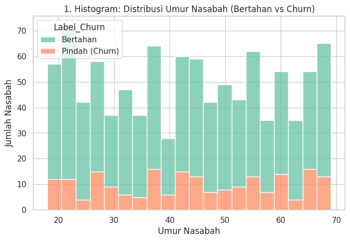
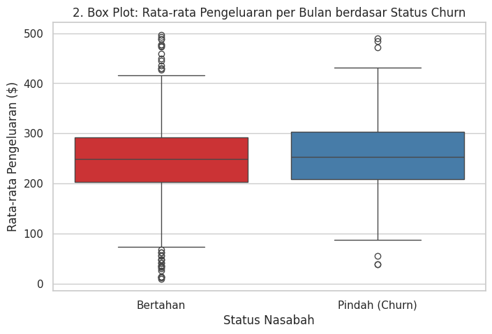
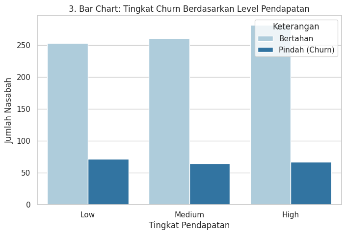
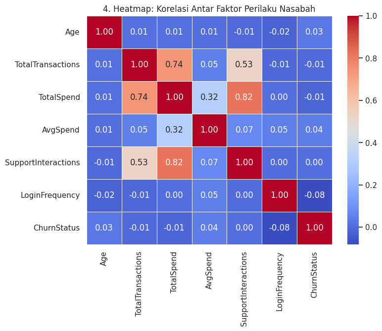

# EXECUTIVE-ANALYSIS-DOCUMENT_LLYODS-BANKS

# PHASE 1 EXECUTIVE ANALYSIS DOCUMENT
## Data Integration, Exploratory Data Analysis (EDA), & Feature Engineering (Data Preprocessing)

* **Initiative Name:** Customer Retention Enhancement through Predictive Analytics
* **Client Entity:** SmartBank (Lloyds Banking Group Subsidiary)
* **Prepared By:** Geza Tri Anggono – Data Science & Analytics Team
* **Date:** Mei 11, 2026

---

## I. Executive Summary
In addressing the rising trend of customer churn at SmartBank, the Data Science team has consolidated over 6,800 historical interaction data points into a unified, single-view profile per customer. This first-phase analysis concludes that churn at SmartBank is not driven by a single linear factor (such as age or income alone), but rather by a complex combination of financial and digital behaviors. Consequently, the data architecture has been fully standardized and is 100% ready for execution using non-linear Machine Learning models (e.g., Random Forest) in Phase 2 to generate high-accuracy retention predictions.

## II. Data Landscape & Architecture
The primary approach was to build a 360-degree customer view. Five distinct datasets were integrated using a relational merge (Left Join) based on CustomerID:

* **Demographics (Socio-Economic Context):** To test the initial hypothesis regarding vulnerabilities within the young professional segment.
* **Transaction History (Financial Health):** Aggregating total spend and frequency to detect declines in account activity, which serve as early warning indicators for churn.
* **Digital Activity & Services (Engagement Levels):** Analyzing app login frequency and complaint history to directly measure digital adoption and service satisfaction.

## III. Deep-Dive Exploratory Data Analysis (EDA)

### 1. Demographic Distribution and Age Hypothesis Validation
<!-- Contoh pemanggilan gambar dari folder assets -->

* **Analysis:** The distribution chart indicates that SmartBank's customer base spans widely from 18 to nearly 70 years old.
* **Business Insight:** The initial hypothesis stating that churn is exclusively dominated by "Young Professionals" is not entirely accurate. Customer attrition occurs evenly across various age brackets. This indicates that future retention campaigns should not solely target specific age groups, but must rather be triggered by their transactional behaviors.

### 2. Monthly Spending Profile and Customer Lifetime Value (CLV) Risk
<!-- Ganti nama file di bawah ini sesuai dengan nama gambar box plot yang kamu upload di folder assets -->

* **Analysis:** The box plot demonstrates that the median spending of both retained and churned customers sits at an equivalent level (approximately $250). However, the wide data dispersion and the presence of outliers within the churned group highlight a critical dynamic.
* **Business Insight:** SmartBank is not only losing customers with small transaction volumes but also High Net Worth Individuals (HNWIs) and SME business owners, represented by the outliers above the upper whisker. Losing a single customer in this outlier demographic carries a significantly heavier financial impact than losing dozens of average retail customers.

### 3. Mapping Customer Economic Scale
<!-- Ganti nama file di bawah ini sesuai dengan nama gambar bar chart yang kamu upload di folder assets -->

* **Analysis:** "Low Income" customers constitute the largest portion of SmartBank's market share. The churn ratio remains relatively proportional to the population size across all income tiers.
* **Business Insight:** Product substitution strategies must be tailored accordingly. Mass-market loyalty programs are suitable for the Low-Income segment, whereas the High-Income segment requires hyper-personalized intervention to prevent attrition.

### 4. Causality Correlation Matrix (Heatmap)
<!-- Ganti nama file di bawah ini sesuai dengan nama gambar heatmap yang kamu upload di folder assets -->

* **Analysis & Algorithm Justification:** The correlation matrix reveals exceptionally weak linear correlation values (ranging from -0.02 to +0.05) against the ChurnStatus target.
* **Business Insight:** This is the most crucial analytical finding. The weak linear correlation mathematically proves that the reasons behind customer attrition are multi-dimensional and overlapping. Traditional statistical models (like simple linear regression) will inherently fail to predict this pattern. Therefore, it is imperative to utilize Tree-based algorithmic models (such as Random Forest) in Phase 2 to uncover these hidden, non-linear patterns.

## IV. Feature Engineering & Data Optimization
To prevent data leakage and ensure the model learns from valid information, the following rigorous Feature Engineering protocols were executed:

* **Logical Business Imputation:** All Null values within the Customer Service history were filled with `0`. Logically, the absence of interaction data indicates that the customer did not report any technical issues.
* **Scale Bias Mitigation (Standardization):** Applied `StandardScaler` to all numeric matrices (e.g., Age, TotalSpend). Without this step, the algorithm would incorrectly weigh TotalSpend (in thousands) exponentially higher than Age (in tens) simply due to the numerical magnitude.
* **Category Binarization (One-Hot Encoding):** All textual categorical variables (Gender, MaritalStatus, IncomeLevel) were transformed into independent binary matrices. This prevents the machine from falsely interpreting a hierarchical (ordinal) relationship where none exists.
* **Outlier Retention:** Extreme transaction data was deliberately retained (not capped or removed). In the banking industry, these outliers represent lucrative SME/HNWI clients, who are the primary targets of this retention analysis.

## V. Deliverables & Next Steps
The primary operational dataset (`cleaned_customer_churn_data.csv`) has been exported and its integrity validated. Based on the Phase 1 findings, the strategic next steps for Phase 2 are:

* **Machine Learning Initiation:** Train a Random Forest Classifier model using the sanitized dataset.
* **Critical Evaluation Metrics:** Given that the churn data is slightly imbalanced (approx. 80% Retained vs. 20% Churned), overall accuracy will not be the primary metric. Model evaluation will heavily index on **Recall** (the ability to detect as many at-risk customers as possible) and **Precision** (preventing misdirected retention promotions).
